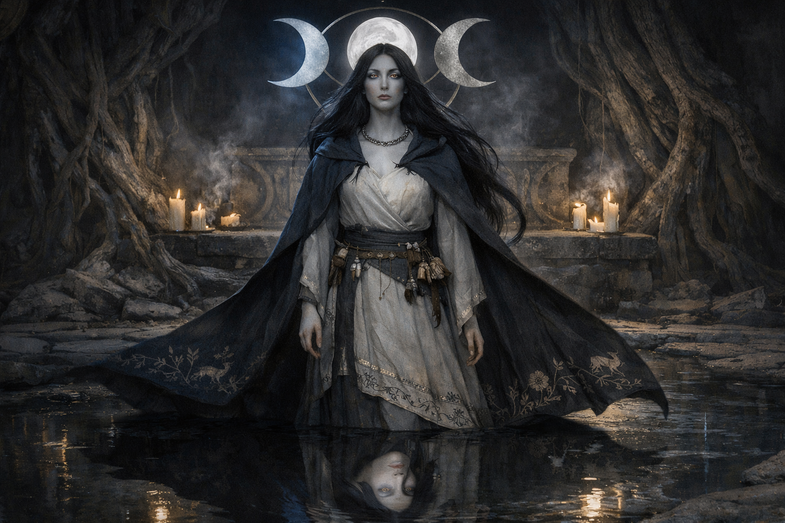
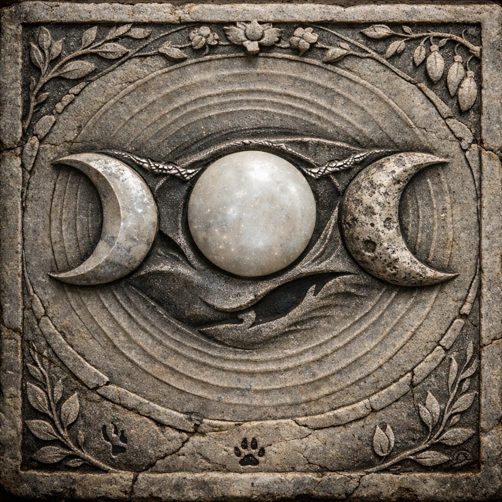

## What players would know

Elunara is the Threefold Moon: a god of cycles, fertility, and return. Her influence is not administered through a single institution the way the Sun is; it shows up as weather in the soul and bias in magic.

Most people don’t claim to “worship” Elunara so much as _live inside_ her phases. Witches and rural rites tend to treat the moons as conditions to negotiate with, not commandments to obey.

### Illustration

### Common rumors

- One moon is always “stronger,” and casting under the wrong one is asking for side effects.
- Triple alignment is bad-weird, not lucky-weird.
- The Church insists its miracles are moon-agnostic. Witches laugh and plan around the sky anyway.

### See also

- [Creation Myth: Sun, Moon, Forest](../../briefings/creation-myth-sun-moon-forest.md)
- [Tears of the Moon](../../magic/tears-of-the-moon.md)
- [The Three Moons](../../magic/three-moons.md)
