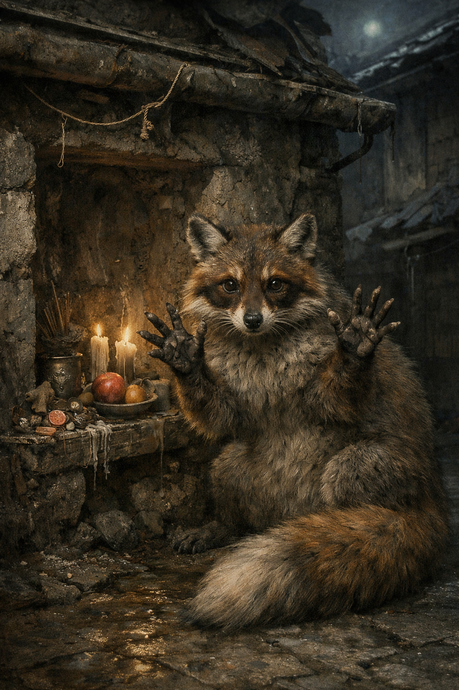

## What players would know

In alley shrines and roofspace hideouts, thieves whisper about the Raccoon Fox: a city-adapted forest spirit that looks like a raccoon with warm brown mask-markings and the long, bushy tail of a fox.

It’s said to be smart enough to treat locks and containers as toys. Its paws are almost handlike—quick, expressive, unsettlingly precise—like “jazz hands” that can find a seam you didn’t know existed.

Burglars don’t pray to it for virtue. They ask for _clean work_: a quiet latch, a missed glance, a lid that opens as if it was always meant to.

### Illustration

### Quick shrine-rite (before a job)

Most shrines are just a hidden niche with three things: a thread of wire, a glossy button, and a bit of dried fruit.

The ritual is a short one:

- tap the doorframe twice (to “announce without waking”)
- show your empty palms (to prove you’re not carrying blood)
- leave a small trinket you stole honestly (coin, button, bent nail)
- whisper: “Bless the hands. Keep the harm small.”

### Common rumors

- The Raccoon Fox doesn’t bless violence. If a job turns bloody, its luck turns inside-out.
- Killing one doesn’t just bring misfortune. It makes you rigid: clever plans stop working.
- Some crews swear the spirit can’t be trapped; it simply decides the trap was never there.

### See also

- [Waldrun](waldrun.md)
- [The Greenwood Accord](../../magic/greenwood-accord.md)
- [The Silent Poet](the-silent-poet.md)
