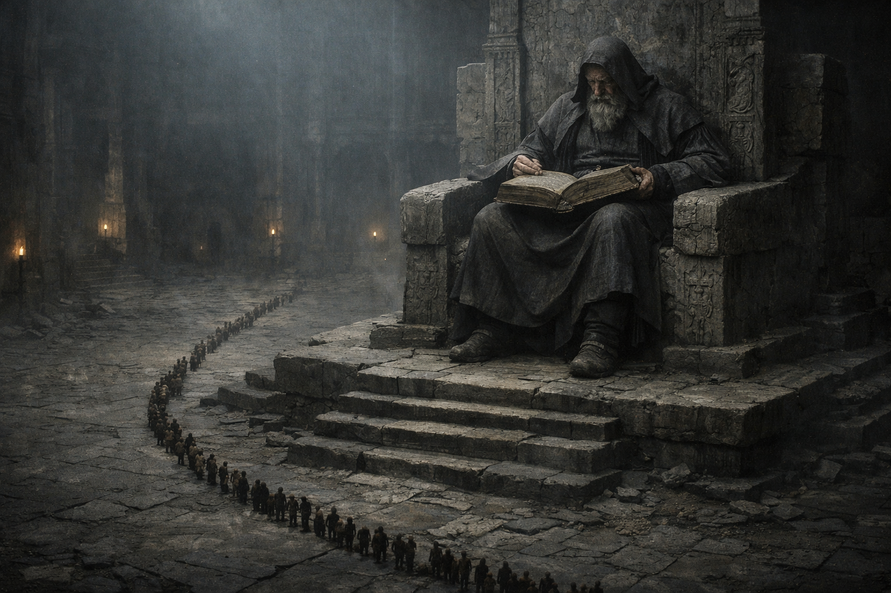
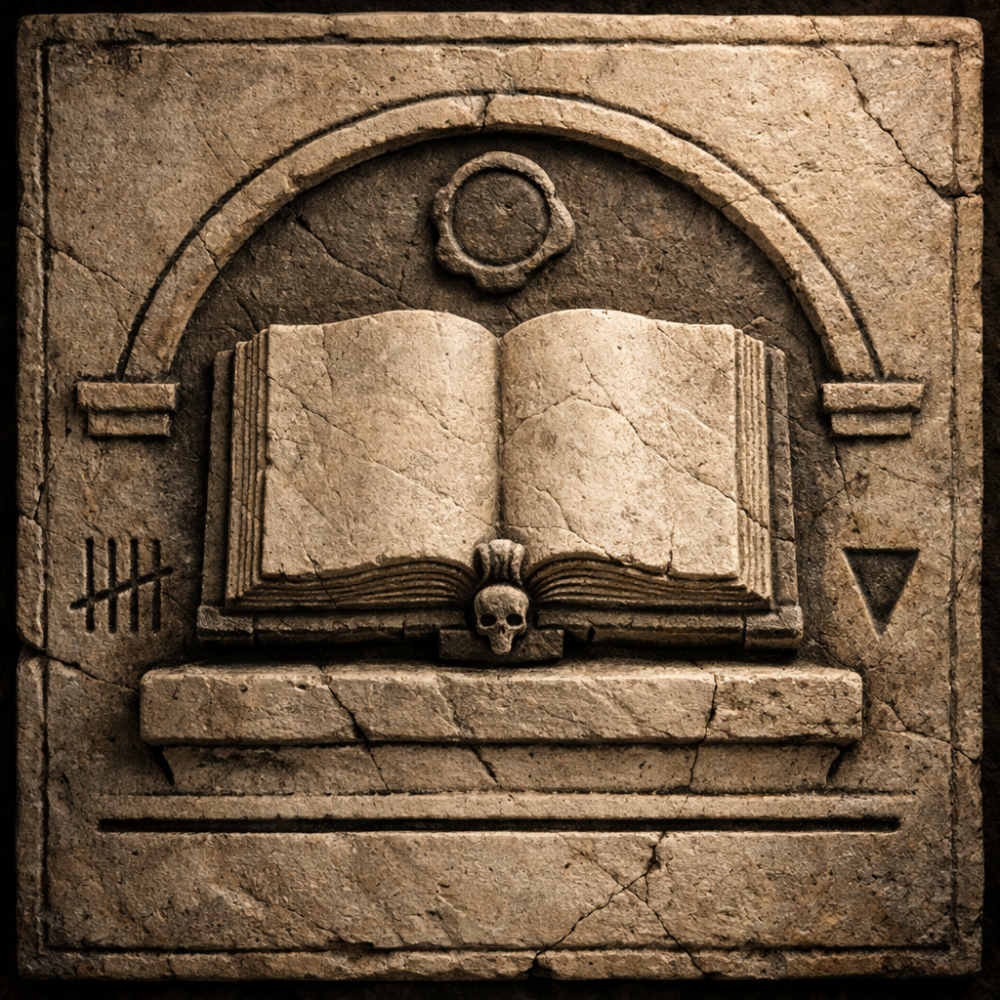

## What players would know

### Illustration (player-safe)

Skaldren is the Underworld: the god of endings, memory, and what remains after the cycle closes. He isn’t framed as evil. He’s framed as inevitable.

People invoke Skaldren in funerary rites, in confessions, and in the quiet language of debt: the sense that some things are “kept” even when no living witness remains.

### Common rumors

- If Althar is witness, Skaldren is receipt.
- The Underworld can be bargained with, but not bribed.
- Some oaths “hold” only because Skaldren remembers the shape of the promise.

### See also

- [Creation Myth: Sun, Moon, Forest](../../briefings/creation-myth-sun-moon-forest.md)
