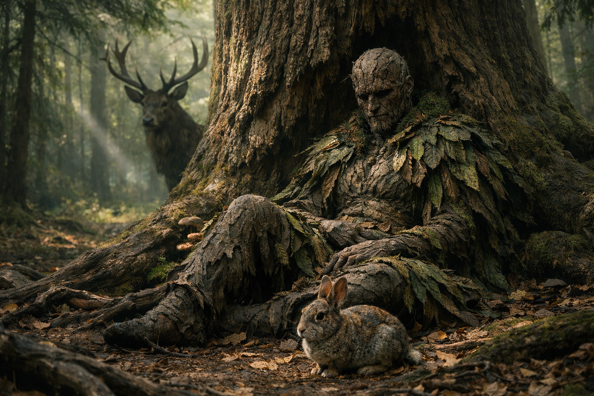

## What players would know

### Illustration (player-safe)

Waldrun is the Forest: the god of borders, wild law, and things that grow without permission. Where Althar’s worship is administered, Waldrun’s is practiced: groves, taboos, animal signs, and the quiet certainty that the land does not care who owns it.

Druidic tradition teaches that mortals can only perceive Waldrun through masks—three sacred forms that do different work in the world:

- the **Stag** (sovereignty, continuity, territorial truth)
- the **Raccoon Fox** (cunning, reuse, adaptive intelligence)
- the **Rabbit** (persistence, fertility as pressure, life that refuses to die)

### Common rumors

- Sacred raccoon foxes can’t be killed without “losing luck,” as if the world stops offering you edge cases.
- Forest oaths don’t care about crowns. They care about witnesses and seasons.
- Druids don’t call this god “good.” They call him _alive_.

### See also

- [Raccoon Fox (Forest Spirit)](raccoon-fox.md)
- [Creation Myth: Sun, Moon, Forest](../../briefings/creation-myth-sun-moon-forest.md)
- [Magical Tattoo Ink](../../magic/spells/magical-tattoo-ink.md)
