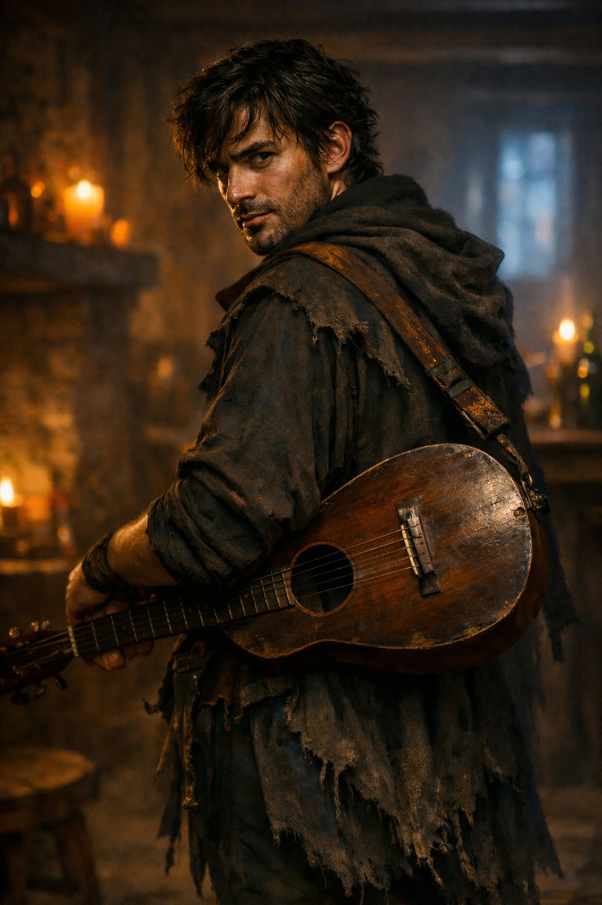

## What players would know

### Portrait (player-safe)

Bob Johnson is the pretty half of a road-duo currently playing
[The Last Lantern Inn](../../locations/last-lantern-inn.md): sharp suit, sharp
smile, and a voice that makes heartbreak sound like a confession made too late.

Town criers and fresh posters around the gate district are billing him and
[Boy Willie Brown](boy-willie-brown.md) as the **"legendary pair from
[Statesboro](../../locations/statesboro.md)"**, which is either true, mostly
true, or the part of the story that helps sell wine.

### Common rumors

- Bob once played a midnight crossroads and came back better than he had any
  right to be.
- One verse in every set feels uncomfortably personal to somebody in the room.
