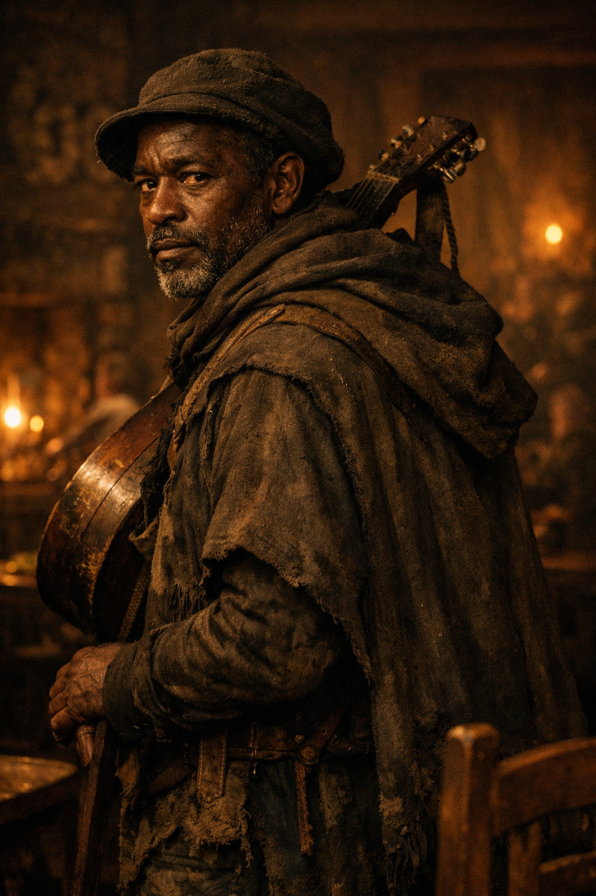

## What players would know

### Portrait (player-safe)

Boy Willie Brown is the quieter half of the Statesboro duo now playing
[The Last Lantern Inn](../../locations/last-lantern-inn.md). He handles the
backing strings, low harmonies, a low slide-played
[Crossing Board](../../economy/crossing-board.md), and the part of the room Bob
would miss while smiling at it.

Most listeners remember Bob first and Willie second, which is exactly how Willie
seems to prefer it.

### Common rumors

- Willie never jokes about crossroads after dark.
- If Bob is the legend, Willie is the reason the legend stays alive.
