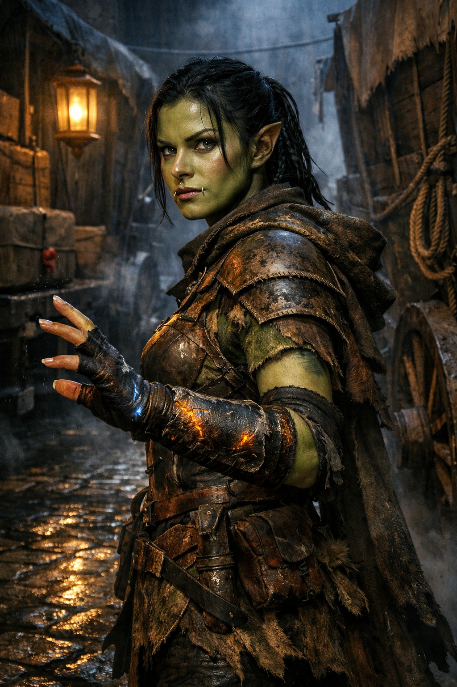

## What players would know

### Portrait (player-safe)

Branka Voss is a half-orc squad lead in the
[Brazen Pike Company](../../factions/brazen-pike-company.md), recognizable by
her battered lamellar coat, spell-scorched bracers, and precise convoy
discipline. She has a practical reputation: no speeches, no heroics, no unpaid
risks.

She is the officer currently commanding the Brazen Pike escort attached to
[The Broadbarrel Caravan](../../institutions/broadbarrel-caravan.md).

### Common rumors

- Branka does "night stabilization" jobs for people with more coin than honesty.
- If Branka says the road is unsafe, she means for everyone else.
- She can leave a killing zone "in seven strides" before anyone draws a bead.
