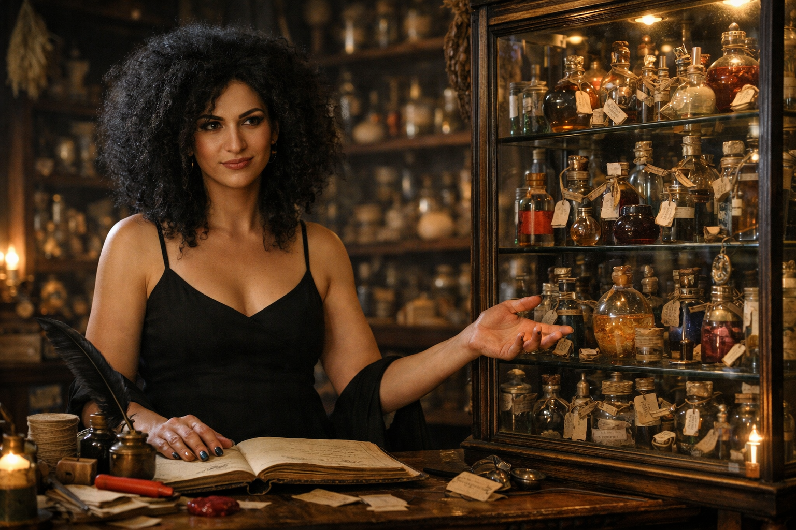

## What players would know

### Portrait (player-safe)

Mordecai Orichalcum is a tall trans woman wizard and the proprietor of **Glass & Moth**, a licensed curios shop in the [Banco Valdieri Quarter](../../locations/banco-valdieri-quarter.md). Her enormous frizzy black curls are just starting to show gray at the edges, and she wears a thin-strapped black dress like it is armor.

She does business from behind a heavy counter, backed by a tall glass case packed with potions, scroll tubes, and a riot of other small magic items that all come with receipts, warnings, and an optional lecture.

### At a glance

- Demeanor: dry, precise, surprisingly kind if you read the fine print.
- Tell: ink-stained fingertips, careful hands, unflinching eye contact.
- Shop vibe: curated chaos with hard rules about custody and consequences.

### Common rumors

- She can tell a cut potion by smell from across the counter.
- If you try to steal from her, you forget what you came in for.
- She keeps one shelf in her display case empty, like it is waiting for something to come home.
