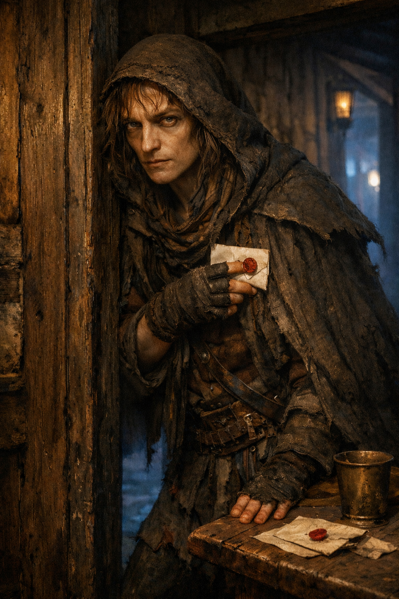

## What players would know

### Portrait (player-safe)

Needle Sava is a gossip-runner and rumor broker in Niederstadt who appears
wherever people are paying to know things quietly. She works tavern edges and
shrine lanes rather than guild halls, and sells introductions more often than
hard evidence.

### Common rumors

- Needle never sells one buyer's name to another buyer.
- If she smiles before naming a price, the price is about to hurt.

