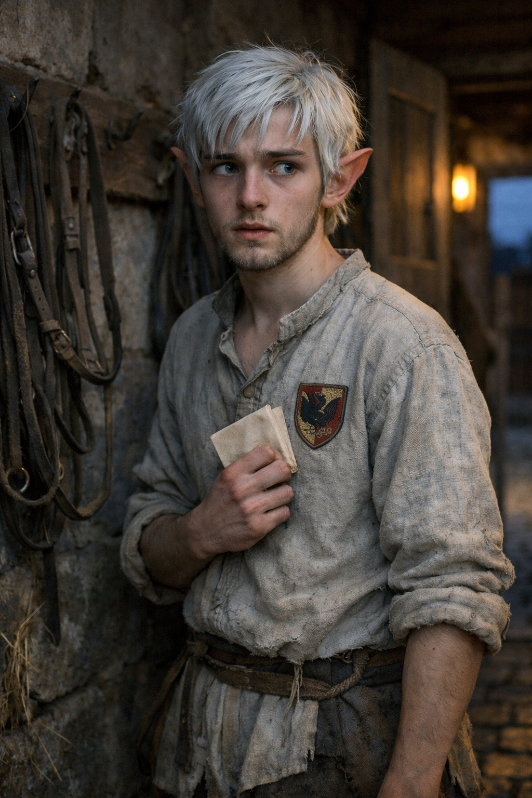

## What players would know

### Portrait (player-safe)

Pietro Sarto is a stable boy and runner at the Valdieri family quarters in
Hochsilvar’s Imperial City. He knows tack, schedules, and which doors servants
are allowed to use. He is a young half-elf, around sixteen, with white hair,
blue eyes, and the start of a wispy beard. He is polite to anyone in good cloth
and wary of anyone who asks questions like a magistrate.

### Common rumors

- He “sees everything” because he is always carrying something from one place to
  another.
