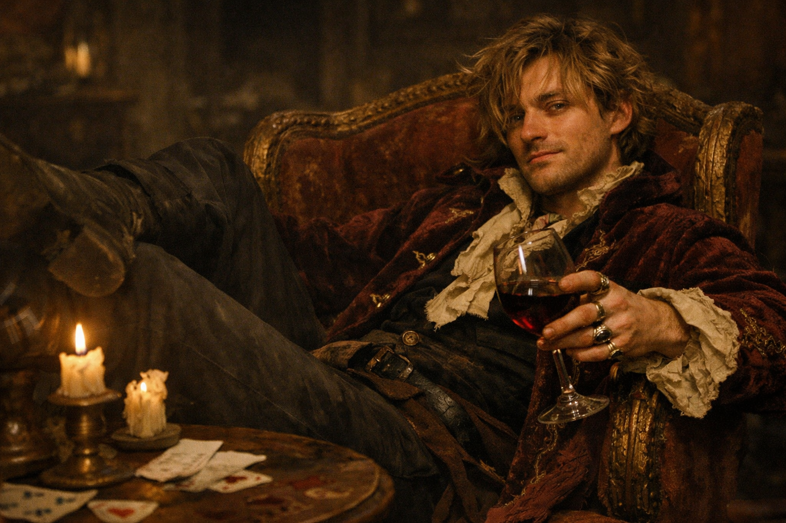

## What players would know

### Portrait (player-safe)

Raffaele Valdieri is a minor Valdieri cousin: the kind of family member who gets invited to dinners for appearances and quietly managed the rest of the time. In Hochsilvar’s rumor economy, he’s “the problem relative” with expensive tastes and unreliable judgment.

### Common rumors

- He’s always one bad decision away from being cut off.
- He disappears for weeks, then returns with new clothes and no explanation.
