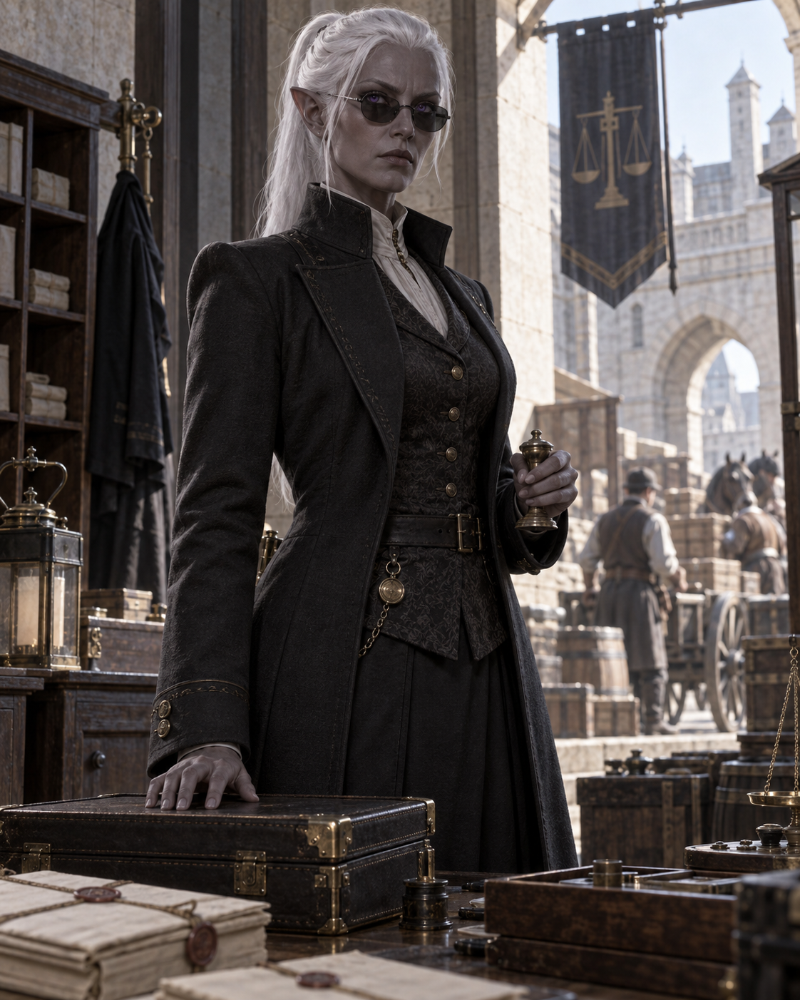

## What players would know

Seldon Finck is a tall female elf of Umbral origin who serves as a Customs and
Excise adjudicator in Valdengratz. She is conservatively dressed, severe in
manner, and rarely raises her voice. In daylight she wears smoked glasses; her
white hair is tied back in a practical ponytail, and her piercing violet eyes
are difficult to forget.

Finck is known for examining documents, seals, and testimony with exacting
care. Her questions are polite, but she expects precise answers.
