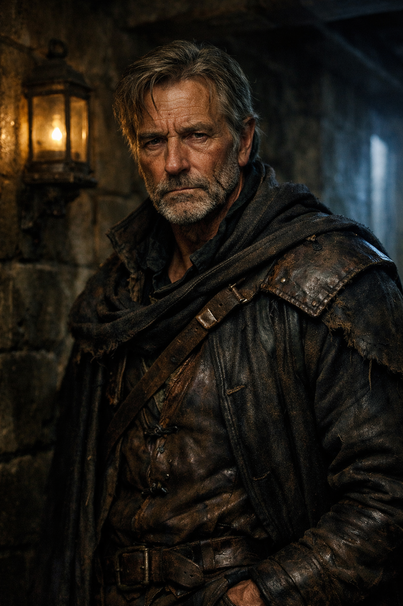

## What players would know

### Portrait (player-safe)

Thane Jäger is spoken of as the kind of imperial field operative people name
only after the door is shut. He has a tall reputation for taking the jobs
everyone else calls impossible, ugly, or suicidal, then returning with the
objective somehow complete and half the room too unsettled to ask how.

### Common rumors

- If Jäger accepted the contract, the job was already worse than anyone said.
- Thane outlived too many teams to be lucky alone.
