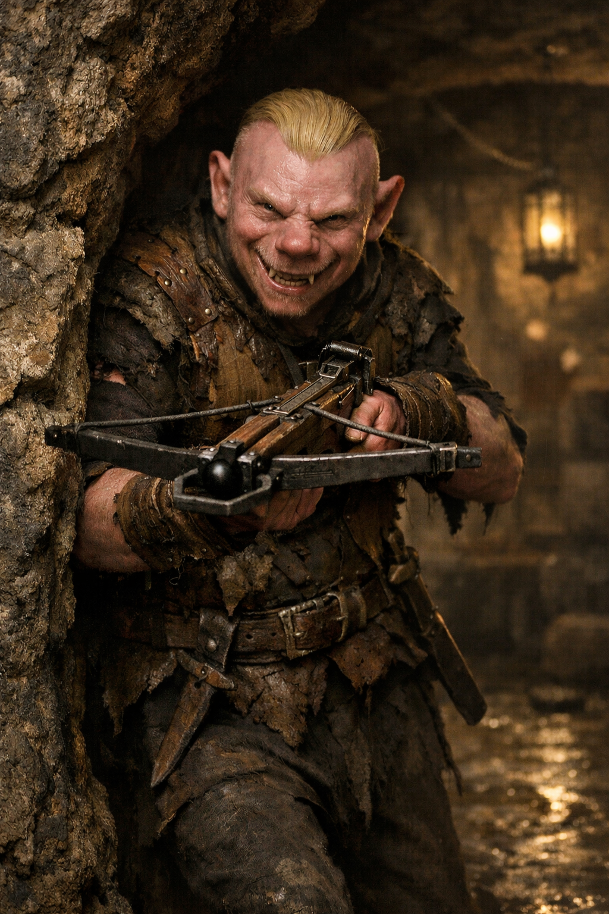

## What players would know

Vile Piglit is a back-alley “rogue” in Niederstadt with an oversized swagger and a weapon he clearly can’t afford to lose. He talks like a veteran and moves like someone who learned intimidation from overheard stories.

### Common rumors

- He practices threats in a mirror.
- He’s “connected,” but only in the way a stray dog is connected to a street.

