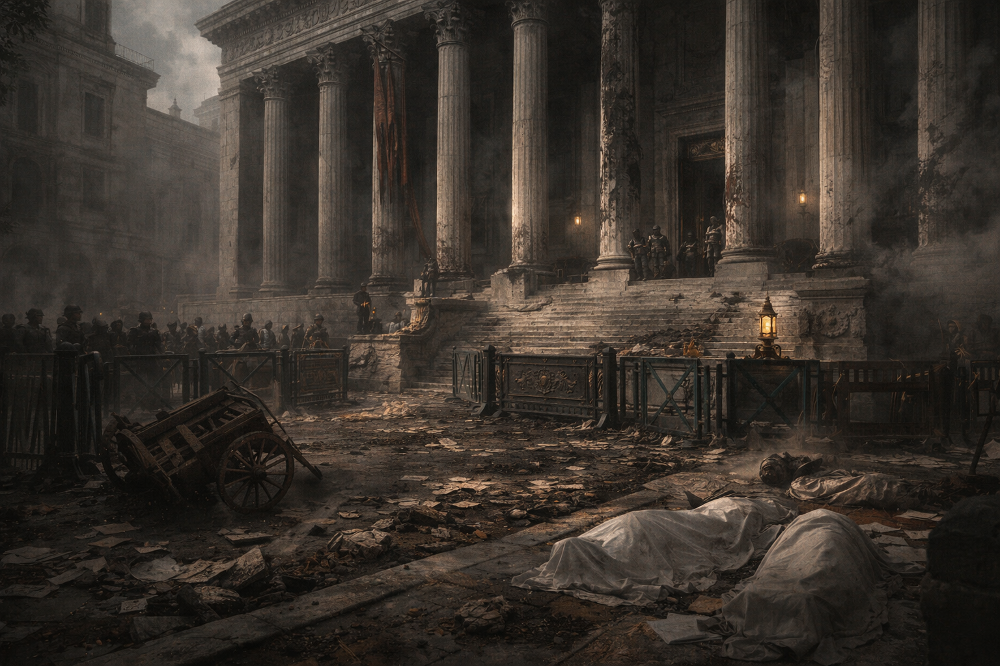

## What the party knows (briefing version)

A high-profile robbery has struck **[Banco Valdieri](../institutions/banco-valdieri.md)** in **[Hochsilvar](../locations/hochsilvar.md)**, threatening public confidence in the new promissory-note system.

It happens **midway through** the capital’s solstice week festival, **[The Royal Games](../institutions/royal-games.md)**: the city is crowded, tempers are short, and everyone with a warrant or a knife is using the noise as cover.

The [City Watch](../institutions/city-watch.md) has sealed the scene under a three-day magical quarantine, and the [Banking Guild](../factions/banking-guild.md) is demanding results loudly enough that even honest clerks can hear it.

You are assigned to a Joint Task Force: City Watch investigators and the Crown-authorized domestic intelligence arm operating across the feudal states.

### Known facts

- The vault shows signs of unusual arcane interference.
- The bank is under Guard quarantine while forensic wizards examine the scene.
- The Royal Games crowd turns every street into an argument, and every empty bed into a commodity.
- The breach occurred at **noon on the solstice**—an auspicious hour in Solar Church calendars.

### Objective (as given)

Identify who stole the refined magic, determine where it is headed, and recover it if possible.

### See also

- [Refined Magic](../magic/items/refined-magic.md)
- [The Royal Games](../institutions/royal-games.md)

## What the party can reasonably discover

If you push on the right doors (and survive the politics), you can uncover:

- **Bank-scene receipts**: time distortion evidence; missing-time inconsistencies; a “rain underground” signature locals won’t stop talking about.
- **Paper trails**: promissory-note signet chains; custody-chain anomalies; documents that look _too_ clean to be honest.
- **Undercity leads**: smuggling logistics; territorial tells; a name that never comes with a face.
- **Transport constraints**: refined magic moves like fragile contraband, which creates slow routes, choke points, and opportunities for interception.
